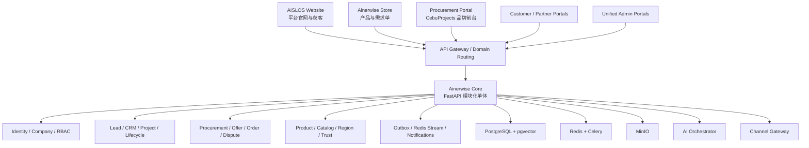

# Ainerwise + CebuProjects + AISLOS 整合评估

日期：2026-06-11

## 1. 核心结论

推荐采用：

> **一个 Ainerwise Core，多套独立品牌 Portal，CebuProjects 的交易能力逐步迁入 Core。**

- AISLOS 官网不是第三套后端。当前 `Ainerwise/frontend-pc` 已经是 AISLOS Website，并且已通过 Portal Mode 同时承载 Ainerwise Store 和 Developer Portal。
- Ainerwise 应作为统一 Core。它已经具备 PostgreSQL + pgvector、Redis、MinIO、Celery、事件总线、AI Orchestrator、Channel Gateway、统一后台、RFQ、Partner Portal、项目与生命周期管理。
- CebuProjects 不应整体并入 AISLOS 官网，也不应长期保留一套重复后端。它最有价值的是成熟的采购交易域，应逐模块迁入 Ainerwise Core。
- 两个现有后端不能直接连接同一个 `public` schema。`users`、`companies`、`regions`、`audit_logs` 等表名相同，但字段、角色、状态枚举和约束不同。
- 短期先通过 API、事件和品牌 Portal 做联动；中期统一身份、公司、产品和区域；长期只保留一个 Core 数据层。

## 2. 当前系统定位

### Ainerwise / AISLOS

主流程：

```text
官网获客 / AI 顾问
  -> Lead / CRM
  -> Solution / Quote
  -> RFQ / Partner Bid
  -> Project / Payment Milestone
  -> Delivery / Acceptance
  -> Asset / Warranty / AMC / Maintenance
```

优势：

- 一个 Core、多 Portal 的架构已经形成。
- 业务事件有 transactional outbox + Redis Stream。
- 文件使用 MinIO，AI 使用独立 Orchestrator，消息使用 Channel Gateway。
- RFQ、Partner、项目交付、资产和维保生命周期比较完整。
- 测试和迁移基础更强，适合作为合并后的主干。

### CebuProjects

主流程：

```text
Buyer Project / Intent
  -> Supplier Matching
  -> Offer Competition
  -> Order
  -> Payment / Escrow
  -> Shipping / Delivery
  -> Review / Dispute / Trust
```

值得迁入 Core 的能力：

- 动态分类 Schema。
- Supplier Catalog 和库存。
- Intent / Offer / Order 交易模型。
- 配送、纠纷、评价、信任分、KYC、风险标记。
- 多区域支付配置、FX、费用明细、结算对账。
- 买卖双方站内消息和站内通知。
- Buyer Project 的 AI 分析、行项目、报告版本与价格比较能力。

## 3. 推荐目标架构



品牌和前端可以独立，后端和数据所有权必须统一：

```text
aislos.com                 -> AISLOS Website
store.ainerwise.com        -> Ainerwise Store
procure.aislos.com         -> Procurement Portal
partner.aislos.com         -> Partner Portal
admin.aislos.com           -> Unified Admin
api.aislos.com             -> Ainerwise Core API
```

如果 CebuProjects 是独立客户品牌，也可以继续使用客户域名，但通过 `portal_id / brand_id / region_id` 连接同一个 Core。

## 4. 哪些应该共用

| 能力 | 推荐归属 | 处理方式 |
|---|---|---|
| PostgreSQL | Ainerwise Core | 短期同实例不同 database/schema；迁移完成后一个 Core 数据库 |
| Redis / Celery | Ainerwise Core | Cebu 的异步通知、匹配、AI 分析迁到现有队列 |
| 文件存储 | MinIO | Cebu 本地 uploads 迁到 FileAsset + MinIO |
| Auth / JWT / RBAC | Ainerwise Core | Core 成为唯一 token issuer，Portal 只消费身份 |
| Company / Membership | Ainerwise Core | 扩展 Ainerwise Company，增加 owner、branch、membership、验证状态 |
| Product / Category | Ainerwise Core | Product 是标准产品；Supplier CatalogItem 是供应商挂牌，二者不能混成一张表 |
| Region / Service Area | Ainerwise Core | 扩展 Region，迁入 Cebu 地图、覆盖半径和 polygon |
| Audit | Ainerwise Core | 保留统一审计表，吸收 Cebu 的 actor_role、user_agent、risk_level |
| Event Bus | Ainerwise Core | 所有域事件走 outbox + Redis Stream |
| Notifications | Ainerwise Core | 保留 Channel Gateway，迁入 Cebu 站内 Notification |
| AI | Ainerwise Core | Cebu Project AI 通过 Orchestrator，AI 产出进入统一审核队列 |
| Payment / Ledger | Ainerwise Core | 保留 Ainerwise 不自持资金原则，吸收 Cebu 的 FX、fee、settlement、reconciliation |

## 5. 哪些业务模型不能硬合并

这些模型看起来相似，但业务含义不同，应保留独立域模型并建立转换：

| CebuProjects | Ainerwise | 推荐关系 |
|---|---|---|
| BuyerProject | Lead / SiteSurvey / Proposal / Project | BuyerProject 是需求设计工作台，可在确认后生成 Lead 或 Project |
| Intent | StoreOrder / Lead / RFQ | Intent 是买家的采购需求，不等于内部 RFQ |
| Offer | PartnerBid / Quote | 产品供应商 Offer 与施工 Partner Bid 分开 |
| Order | Project / StoreOrder | Order 是交易订单；需要交付服务时再生成 Project |
| EscrowTransaction | PaymentPlan / LedgerEntry | 使用统一账本和 PSP 状态，禁止平台自持客户资金 |
| Delivery | Project delivery stage | 商品配送记录与工程项目交付阶段保持关联但不合表 |
| Dispute | Ticket | Dispute 是交易争议，Ticket 是售后/服务工单，不能混为同一个状态机 |
| TrustProfile | PartnerMetric / SupplierScorecard | 可共享评分数据，但保留不同评分视角 |

建议新增清晰的采购域命名：

```text
procurement_requests
supplier_listings
supplier_offers
commerce_orders
order_deliveries
order_disputes
transaction_reviews
trust_profiles
risk_flags
```

## 6. 数据库合并风险

### 不能直接共用现有 public schema

当前冲突包括：

- `users`：角色值、账户状态、2FA、通知偏好不同。
- `companies`：Ainerwise 使用用户外键归属；Cebu 使用 owner、branch、KYB/验证等级。
- `regions`：Ainerwise 偏国家/税务；Cebu 偏城市/地图/服务覆盖范围。
- `audit_logs`：字段和事务行为不同。
- `messages`：Ainerwise 的 AI Conversation Message 与 Cebu 的业务线程消息语义不同。

### 迁移前必须统一的规范

- 状态值统一为小写字符串，避免一边 PostgreSQL Enum 大写、一边 String 小写。
- 金额统一使用 `NUMERIC` 或整数 minor units，禁止继续使用 Float 存金额。
- 所有跨域引用补真实 Foreign Key。
- Token 增加 `iss`、`aud`、`portal_id`、`region_id`，商业多租户开放前增加 `tenant_id`。
- Portal/品牌上下文由网关域名或受信 token claim 决定，不能相信浏览器随意传入的 Header。
- 所有写操作、审计和 outbox event 在同一个事务中完成。

## 7. AISLOS 官网如何联动

### 第一层：品牌和入口联动

AISLOS 官网增加一个 Procurement / Supplier Network 解决方案入口：

```text
AISLOS 官网
  -> "Start a Procurement Request"
  -> Procurement Portal 发布需求
  -> "Become a Supplier"
  -> Supplier onboarding / KYC
```

交易页面保持在独立 Portal，不把供应商目录、钱包、纠纷等页面塞进官网。

### 第二层：线索和交易联动

建议事件链：

```text
aislos.lead.created
  -> 可转为 procurement.request.created

procurement.request.published
  -> Supplier matching + notification

procurement.offer.awarded
  -> commerce.order.created

commerce.order.accepted
  -> 需要工程交付时创建 Ainerwise Project

commerce.order.completed
  -> 更新 Trust / Partner Metrics / Case Dataset

commerce.dispute.opened
  -> Admin Risk Queue + 暂停相关 payout
```

### 第三层：数据和 AI 联动

- Cebu 的成交价格、供应商响应、延期、纠纷率进入 Ainerwise Partner/Supplier 数据资产。
- AISLOS Procurement Agent 使用这些真实交易数据做匹配、比价和风险建议。
- AI 只能推荐供应商、排序 Offer、生成草稿；授标、退款、放款继续人工批准。

## 8. 分阶段实施建议

### Phase 0：先建立联动，不合库

目标：最快看到业务协同，风险最低。

1. 保留两套数据库和登录。
2. 使用 Ainerwise `/internal/v1` 和事件总线建立 API Bridge。
3. AISLOS 官网增加 Procurement CTA，跳转到 Cebu Procurement Portal。
4. Cebu 发布 `procurement.request.created / order.completed / dispute.opened` 事件。
5. Ainerwise 接收事件并创建 Lead、CRM Activity 或 Project 候选。

### Phase 1：统一基础设施和身份

1. Cebu 使用 Ainerwise PostgreSQL 实例、Redis、MinIO，但暂时使用独立 database/schema。
2. Core 成为唯一身份发行方，建立 SSO token exchange。
3. 统一 User、Company、Membership、Region、FileAsset。
4. 删除 Cebu 独立 `admin-backend`，后台 API 进入统一 Core。

### Phase 2：迁移采购交易域到 Ainerwise Core

按依赖顺序迁移：

```text
Category schema / Supplier Listing
  -> Intent / Matching / Offer
  -> Order / Delivery / Message / Notification
  -> Dispute / Review / Trust / Risk
  -> Payment Config / FX / Settlement
```

每迁移一个模块：

- 新 Core API 与旧 API 做 parity test。
- 旧 Cebu 前端先改指向 Core API。
- 双写仅用于短期迁移，必须有截止日期。
- 数据核对通过后关闭旧模块。

### Phase 3：Portal 收敛

1. Cebu PC/H5 保持独立品牌体验，但改为 Ainerwise Core 的 Portal。
2. 公共前端能力提取为共享 composable、API client、auth 和 design tokens。
3. 不强求所有前端使用同一套 UI；共享 Core 和契约比共享页面更重要。

## 9. 最先做的一个可见闭环

推荐先实现：

```text
AISLOS 官网 Procurement CTA
  -> Cebu 发布采购需求
  -> Ainerwise 自动创建带 source_portal 的 Lead
  -> Ainerwise Admin 能看到需求和来源
  -> Cebu 订单完成后回写 Ainerwise Project / Supplier Metrics
```

这个闭环不需要立即合并用户表，也能马上验证两个项目联动是否产生业务价值。

## 10. 明确不要做

- 不要让两个后端直接写对方的业务表。
- 不要把现有两个数据库直接恢复到同一个 `public` schema。
- 不要共享同一个 HS256 Secret 来伪装 SSO。
- 不要把 Cebu 的所有页面塞进 AISLOS 官网。
- 不要把 Intent、RFQ、Quote、Order、Project 合成一个万能表。
- 不要同时长期维护两套 Auth、Company、Product、Region、Audit 和 Admin Backend。

## 11. 共享中间件冻结决定

两个项目未来共用物理中间件和运维能力，但不长期保留两套业务核心。

```text
Ainerwise Core = 唯一业务底座和业务数据写入者
Cebu = 逐步收敛为 Ainerwise Core 上的逻辑 Procurement Portal
CebuProjects backend = 迁移来源，完成核对后退役
```

可以共用 PostgreSQL、Redis、MinIO、Nginx、备份、恢复、日志、指标和告警的物理资源。

过渡期必须隔离 PostgreSQL database/schema/role、Alembic migration 链、Redis ACL/namespace/queue、MinIO service account/bucket/policy，以及所有 Token 和 Secret。

完整执行控制板：

`/Users/mac/Code_Start/Aislos/SHARED_PLATFORM_MIDDLEWARE_PLAN.md`
