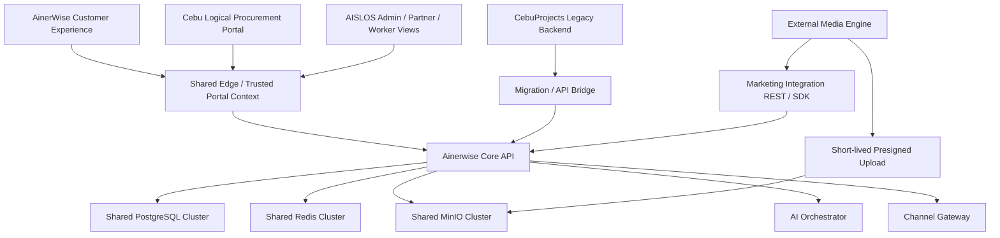

# AISLOS Shared Platform Middleware Plan V1

更新日期：2026-06-11

适用仓库：

- 主实现仓库：`/Users/mac/Code_Start/Aislos/Ainerwise`
- 迁移参考仓库：`/Users/mac/Code_Start/Aislos/CebuProjects`
- 外部媒体系统：独立系统，只通过 AISLOS Marketing Integration API / SDK 对接

上游文档：

- `/Users/mac/Code_Start/Aislos/INTEGRATION_ASSESSMENT.md`
- `/Users/mac/Code_Start/Aislos/PROCUREMENT_PHASE1_EXECUTION_TASKS.md`
- `/Users/mac/Code_Start/Aislos/Ainerwise/docs/AISLOS_MARKETING_INTEGRATION_V4_TASKS.md`
- `/Users/mac/Code_Start/Aislos/Ainerwise/docs/PORTAL_FIELD_SERVICE_V1_TASKS.md`

---

## 0. 冻结原则

> **Share infrastructure capacity, not data ownership or hidden coupling.**

中文解释：

> 共用物理中间件和运维能力，但不共享业务表写权限、Root 凭据、隐藏协议或内部实现。

长期目标：

```text
AinerWise / AISLOS / Cebu Portal
  -> Ainerwise Core（唯一业务底座）
  -> Shared Platform Middleware

CebuProjects legacy backend
  -> 只作为迁移来源
  -> 迁移完成后退役

External Media Engine
  -> 只通过 REST/OpenAPI/SDK + presigned upload 对接
  -> 永远不接入 AISLOS 数据库、Redis 或内部队列
```

---

## 1. 直接结论

### 1.1 必须共用

生产环境最终只维护一套共享平台资源：

- 一个 PostgreSQL 16 + pgvector 集群。
- 一个 Redis 集群。
- 一个 MinIO 集群。
- 一个可信入口层：Nginx / TLS / hostname routing。
- 一套备份、恢复、日志、指标、告警和密钥管理策略。
- 一个 Ainerwise Core API、AI Orchestrator、Channel Gateway 和 Outbox/Event 规范。

### 1.2 必须隔离

即使物理资源共用，也必须隔离：

- PostgreSQL database、schema、role 和 migration ownership。
- Redis ACL、key prefix、Celery queue 和事件消费组。
- MinIO service account、bucket、prefix 和 bucket policy。
- Service Token、Integration Client Secret 和用户 Token。
- Portal、Workspace、Region 和未来 Tenant 的数据可见性。

### 1.3 绝不能共用

- 两个后端不能同时写同一个现有 `public` schema。
- Cebu Alembic 不能对 Ainerwise Core 数据库执行迁移。
- 不共享数据库超级用户、MinIO Root、HS256 Secret 或未隔离 Redis queue。
- 不让外部媒体系统访问 AISLOS Redis、数据库、Celery 或内部文件目录。
- 不做永久双写。

---

## 2. 目标拓扑



核心规则：

- Portal 是品牌、策略、权限和布局，不是第二套业务核心。
- Ainerwise Core 是业务数据唯一写入所有者。
- Legacy Cebu 只能通过迁移脚本或受控 API Bridge 把数据送入 Core。
- 外部系统只能使用公开契约，不能共享内部中间件。

---

## 3. 共享中间件矩阵

| 能力 | 当前状态 | 过渡期 | 最终状态 |
|---|---|---|---|
| PostgreSQL | Ainerwise、Cebu 各自数据库 | 可共用物理集群，但使用独立 database + role | 业务数据进入 Ainerwise Core；Cebu legacy DB 只读后退役 |
| pgvector | Ainerwise 已具备 | Cebu AI 数据通过 API 迁移，不直接写向量表 | Ainerwise AI schema 唯一拥有者 |
| Redis | Ainerwise 已用于 Celery、缓存、事件 | Legacy 如需接入，必须独立 ACL、前缀和 queue | Ainerwise Core 统一使用；legacy namespace 退役 |
| MinIO | Ainerwise 已使用；Cebu 仍有本地 uploads | Cebu 文件进入隔离 import bucket，再迁入 FileAsset | 一个 MinIO 集群，按用途隔离 bucket/policy |
| Nginx / Edge | Ainerwise 已有 | 增加可信 hostname -> portal context 映射 | 唯一外部入口 |
| Auth | 两套 JWT/Auth | Token exchange 或迁移映射；绝不共享 Secret | Core 唯一身份发行方 |
| Audit | 两套模型 | Legacy 事件转换后写入 Core Audit | Core Audit 唯一权威记录 |
| Events | Ainerwise Outbox + Redis Stream | Legacy 通过签名 API Bridge 提交事件 | Core Outbox / Event 规范 |
| AI | Ainerwise Orchestrator；Cebu 有本地 AI service | Cebu 能力迁入 Orchestrator workflow | Core 共用 AI 能力和审核门 |
| Media Engine | 外部系统 | REST/OpenAPI/SDK + presigned upload | 始终保持外部，不共享中间件 |
| Observability | 分散 | 统一 service / portal / region 标签 | 一套日志、指标、告警和审计查询 |
| Backup / Restore | 分散 | 同集群备份，按 database/bucket 独立恢复测试 | 一套策略，多个独立恢复单元 |

### 3.1 当前已发现的本地运行风险

2026-06-11 检查发现：

- 当前 Docker compose project 名称为 `ainerwise`。
- `backend` 容器绑定 `/Users/mac/Code_Start/Aislos/Ainerwise/backend`。
- 其余已运行 Ainerwise 服务多数绑定 `/Users/mac/Code_Start/Ainerwise`。
- Cebu compose 当前未运行。
- 当前 Ainerwise migration 链解析结果为单一 head `027`；Cebu migration 链为单一 head `0015`。

这意味着本地环境正在混用两个 Ainerwise checkout。任何测试、重启或迁移都可能出现“Backend 是新代码，Worker/Frontend/Orchestrator 是旧代码”的版本漂移。

在修改共享部署前，必须先冻结：

- 唯一 canonical workspace 路径。
- 唯一明确的 `COMPOSE_PROJECT_NAME`。
- 每个容器允许绑定的源码路径。
- 切换 workspace 前的停机、备份和回滚步骤。

未经用户明确批准，不得自动停止、删除或重建当前混合路径容器。

---

## 4. PostgreSQL 规则

### 4.1 过渡期

可以共用同一个 PostgreSQL 物理实例，但必须使用独立 database 和 role：

```text
ainerwise_core database
  owner: ainerwise_migration
  app role: ainerwise_backend

cebu_legacy database
  owner: cebu_legacy_migration
  app role: cebu_legacy_backend
```

强制要求：

- Cebu migration 只允许连接 `cebu_legacy`。
- Ainerwise migration 只允许连接 `ainerwise_core`。
- Cebu legacy role 无法读取或写入 Core database。
- 数据迁移使用一次性 migration role 或 Core API，不使用应用超级权限。

### 4.2 最终状态

- 新业务表只进入 Ainerwise Core。
- Cebu 能力按模块迁入 Core，不复制已有 Auth、Company、Region、Audit。
- Legacy 数据库完成核对后转为只读，观察期结束后停止运行。

### 4.3 Migration 全局锁

任何 Agent 创建 Alembic migration 前必须：

1. 检查 Procurement、Marketing Integration 和 Shared Platform 三份任务板。
2. 确认没有其他栏目正在创建 migration。
3. 执行 `alembic heads`，结果必须只有一个 head。
4. 在当前栏目交付记录写明 `down_revision`。
5. 验证 Agent 再次确认单一 head。

禁止两个 Agent 同时创建 migration，也禁止 Cebu migration 链与 Ainerwise migration 链合并。

---

## 5. Redis 规则

共用 Redis 物理资源不代表共用命名空间。

```text
ainerwise:cache:*
ainerwise:rate:*
ainerwise:celery:*
ainerwise:stream:events

cebu-legacy:cache:*
cebu-legacy:celery:*
cebu-legacy:stream:bridge
```

Celery queue 必须显式命名：

```text
ainerwise.default
ainerwise.ai_ingestion
ainerwise.automation
cebu-legacy.default
```

要求：

- 使用 Redis ACL 限制服务可访问的 key pattern。
- Cache、Broker、Event Stream 不得使用相同未加前缀的 key。
- Consumer group 名称必须带服务前缀。
- Legacy 不直接向 Core Event Stream 发布业务事件，使用签名 API Bridge。
- Redis 不是权威数据源；故障不能造成业务状态永久丢失。

---

## 6. MinIO 规则

推荐 bucket：

```text
product-assets
knowledge-source
project-evidence
marketing-assets
documents
cebu-legacy-import
quarantine
```

要求：

- 每个服务使用独立 MinIO service account，应用不得使用 Root 凭据。
- 外部系统只获得短期 presigned URL。
- `cebu-legacy-import` 只用于迁移，不作为长期业务文件入口。
- 外部上传先进入私有 incoming/quarantine 路径。
- 校验、审核完成后才移动到正式路径。
- 对象必须有 checksum、owner、region/workspace、retention metadata。
- 下载默认使用短期签名 URL，不公开 bucket。
- 删除使用 retention policy 和审计流程。

---

## 7. 身份、服务与 API 边界

- 长期由 Ainerwise Core 成为唯一用户 Token issuer。
- 一个账号通过 Membership 获得多个 Workspace / Company / Portal 权限。
- Portal Context 由可信网关根据 hostname 注入，浏览器提交的 `portal_key` 不可信。
- Backend、AI Orchestrator、Channel Gateway、Celery 使用不同 service identity。
- 每个 service token 可轮换、可撤销、有最小 scope。
- 外部系统使用独立 Integration Client，只能调用版本化 REST/OpenAPI、SDK 或签名事件入口。
- 外部系统不直接访问共享中间件。

---

## 8. 可观测性、配额与恢复

共享资源必须能按以下标签查看：

```text
service
environment
portal
workspace
region
integration_client
correlation_id
```

必须监控：

- API 请求量、错误率和延迟。
- PostgreSQL connection、锁、慢查询和存储增长。
- Redis memory、eviction、queue depth 和 consumer lag。
- MinIO bucket size、失败上传、孤儿对象和校验失败。
- Celery backlog、失败、重试和执行时长。
- Integration Client 请求量、401/403/409/429 和失败率。

恢复要求：

- PostgreSQL 和 MinIO 都必须备份。
- 每个 database 和关键 bucket 必须可独立恢复。
- 至少季度执行一次 restore drill，并记录 RPO、RTO 和校验结果。

配额要求：

- Integration Client、Portal、Workspace 和 Region 必须可设置请求/存储配额。
- 达到配额应明确返回 `429` 或可操作错误，不允许静默丢数据。

---

## 9. 本地与生产部署策略

### 9.1 本地开发

- 当前两个 compose 暂时保留，避免一次性破坏开发环境。
- 新功能只在 Ainerwise Core 实现。
- CebuProjects 默认作为参考和迁移来源，不要求日常启动完整后端。
- 后续提供共享 infrastructure profile，只启动 PostgreSQL、Redis、MinIO 和必要 Core 服务。
- Legacy 联调时使用独立 database、role、端口和 namespace。

### 9.2 生产环境

- 不部署两套重复 PostgreSQL、Redis 和 MinIO。
- 不长期部署 Cebu 独立 Admin Backend。
- Portal 可以有多个 hostname 和逻辑界面，但都进入 Ainerwise Core。
- 外部媒体系统保持独立部署，只消费标准 API。

---

## 10. 多 Agent 任务控制板

| 完成 | 栏目 | 名称 | 状态 | 依赖 |
|---|---|---|---|---|
| `[x]` | SP00 | 共享中间件边界冻结 | `VERIFIED` | 无 |
| `[x]` | SP01 | 资源、Owner、Namespace 与凭据清单 | `VERIFIED` | SP00 |
| `[x]` | SP02 | 本地共享 Infrastructure Profile | `VERIFIED` | SP01 |
| `[x]` | SP03 | Legacy API Bridge 与事件边界 | `VERIFIED` | SP02 |
| `[x]` | SP04 | Cebu 文件与身份迁移方案 | `VERIFIED` | SP03 |
| `[x]` | SP05 | 采购域迁移与 Legacy 中间件退役 | `VERIFIED` | SP04 |
| `[x]` | SP06 | 生产配额、监控、备份与恢复闸门 | `VERIFIED` | SP05 |

任何时刻只允许一个 SP 栏目处于 `READY`、`IN_PROGRESS` 或 `READY_FOR_VERIFY`。

协调规则：

- SP01 只允许文档和配置清单，不创建 migration、不修改业务代码。
- Procurement 和 Marketing Integration 可以继续非重叠任务。
- Shared Platform Agent 不得修改其他任务板状态。
- 所有 migration 继续遵守第 4.3 节全局锁。

---

# SP01 资源、Owner、Namespace 与凭据清单

状态：`VERIFIED`

## 目标

建立一份机器可读和一份人类可读的共享平台清单，先把资源所有权和隔离边界写清楚，再改部署。

## 允许修改范围

- `Ainerwise/docs/shared-platform/RESOURCE_MANIFEST.md`，新增
- `Ainerwise/docs/shared-platform/resource-manifest.yaml`，新增
- `Ainerwise/docs/shared-platform/MIGRATION_COORDINATION.md`，新增
- 本文档 SP01 状态和交付记录

## 必须记录

- 每个服务的 owner、用途和环境。
- 当前容器的 compose project、config file、working directory 和 bind mount 来源。
- 唯一 canonical workspace 与 `COMPOSE_PROJECT_NAME`。
- PostgreSQL database/schema/role/migration owner。
- Redis ACL、prefix、queue、stream 和 consumer group。
- MinIO bucket、prefix、service account 和 retention。
- 对外 hostname、可信 portal mapping 和内部 endpoint。
- Service Token / Integration Client 的 scope 与轮换责任，不记录真实 secret。
- 备份范围、RPO、RTO、restore owner 和退役条件。

## 禁止范围

- 不写入真实密码、Token 或 Secret。
- 不修改 compose、env、数据库、Redis、MinIO 或业务代码。
- 不创建 migration。
- 不修改 CebuProjects 业务代码。

## 验证重点

- 清单覆盖 Ainerwise 和 Cebu 当前资源。
- 清单识别并解决“同一 compose project 混用多个源码 checkout”的风险。
- 每个共享物理资源都有清晰逻辑隔离。
- 外部媒体系统没有数据库、Redis、队列或 MinIO 长期凭据。
- 每个 Legacy 资源都有退役条件。
- Migration Coordination 能阻止并行 Alembic migration。

## 交付记录

```text
实现 Agent：Cursor Agent（总协调）— SP01 实现
实现日期：2026-06-11
主要文件：
  - Ainerwise/docs/shared-platform/RESOURCE_MANIFEST.md
  - Ainerwise/docs/shared-platform/resource-manifest.yaml
  - Ainerwise/docs/shared-platform/MIGRATION_COORDINATION.md
自测结果：三份文档覆盖 canonical workspace、compose 标签、checkout 漂移风险、PG/Redis/MinIO 隔离、Portal mapping、凭据边界、备份/退役门禁、migration 全局串行规则
已知限制：
  - 容器 bind mount 切换需 SP02 + 用户批准维护窗口，本文档仅记录不执行
  - Cebu Legacy database/role 为规划项，待 SP02 profile 落地
  - 未写入任何真实 secret

验证 Agent：独立验证 Agent（总协调调度，非实现 Agent）
验证日期：2026-06-11
验证结果：
  - 清单识别 backend/marketing-portal 已绑定 canonical path，其余 14 个服务仍绑定 /Users/mac/Code_Start/Ainerwise
  - migration_lock.global_serial=true 与 MIGRATION_COORDINATION.md 一致
  - 外部媒体系统 forbidden 列表完整；无 compose/业务代码变更
结论：VERIFIED
```

---

## 11. 后续栏目验收定义

- `SP02`：提供共享依赖开发 profile；Legacy 使用独立 database/role/namespace。
- `SP03`：Legacy 只通过签名、幂等、审计的 Bridge 向 Core 提交数据。
- `SP04`：本地 uploads 迁入隔离 import bucket；建立身份映射，不共享 JWT Secret。
- `SP05`：按模块完成 parity、迁移、核对、只读观察和退役，不保留永久双写。
- `SP06`：完成配额、告警、backup 和 restore drill。

---

## 12. Agent 提示词

### 实现 Agent

```text
读取：
/Users/mac/Code_Start/Aislos/SHARED_PLATFORM_MIDDLEWARE_PLAN.md
/Users/mac/Code_Start/Aislos/INTEGRATION_ASSESSMENT.md

只领取 Shared Platform 文档中唯一 READY 栏目。
开始前将栏目改为 IN_PROGRESS。
严格遵守允许修改范围，不修改业务代码，不创建 migration，不写入真实 Secret。
完成后填写交付记录并改为 READY_FOR_VERIFY。
不得自行标记 VERIFIED。
```

### 验证 Agent

```text
读取：
/Users/mac/Code_Start/Aislos/SHARED_PLATFORM_MIDDLEWARE_PLAN.md

只验证当前 READY_FOR_VERIFY 栏目。
检查资源所有权、逻辑隔离、凭据边界、迁移锁和退役条件。
通过后标记 VERIFIED，并只解锁下一栏目。
失败时记录证据并退回 IN_PROGRESS。
不要实现下一栏目。
```

---

## 13. 当前下一步

当前唯一可领取 Shared Platform 任务：

> **Shared Platform SP00–SP06 已全部 `VERIFIED`。**

---

# SP03 Legacy API Bridge 与事件边界

状态：`VERIFIED`

## 交付物

- migration `033`：`legacy_bridge_idempotency`, `legacy_identity_mappings`
- `POST /api/v1/legacy-bridge/events`（HMAC + 幂等 + 审计 + outbox）
- Redis `cebu-legacy:stream:bridge` 镜像流
- Core 事件流 `ainerwise:stream:events`
- `CebuProjects/backend/app/services/ainerwise_bridge.py`
- `tests/test_legacy_bridge.py`

## 验证（2026-06-11）

- `test_legacy_bridge.py` 4 passed
- 全量 backend：**272 passed**

---

# SP04 Cebu 文件与身份迁移方案

状态：`VERIFIED`

## 交付物

- `docs/shared-platform/CEBU_IDENTITY_FILE_MIGRATION.md`
- `init-minio-buckets.sh`, `migrate-cebu-uploads-to-minio.sh`
- Bridge 事件 `legacy.identity.map`

---

# SP05 采购域迁移与 Legacy 中间件退役

状态：`VERIFIED`

## 交付物

- `docs/shared-platform/CEBU_PROCUREMENT_PARITY.md`
- `verify-procurement-parity.sh`
- Phase 1 Core 为采购写入权威路径；Legacy 仅 Bridge + 可选 `:8100`

---

# SP06 生产配额、监控、备份与恢复闸门

状态：`VERIFIED`

## 交付物

- `docs/shared-platform/OPS_QUOTAS_MONITORING.md`
- `backup-postgres.sh`, `restore-drill.sh`

---

# SP02 本地共享 Infrastructure Profile

状态：`VERIFIED`

## 目标

提取共享 PostgreSQL / Redis / MinIO compose profile；修复 canonical bind mount 漂移；为 Cebu legacy 提供独立 database/role/端口，不合并 migration 链。

## 交付物

- `docker-compose.infrastructure.yml` — 共享中间件
- `docker-compose.yml` — `include` 中间件 + 全栈应用
- `docker-compose.legacy-cebu.yml` — 可选 Cebu legacy（`:8100`）
- `docker/postgres/init/02-cebu-legacy-database.sh`
- `scripts/shared-platform/*.sh`
- `docs/shared-platform/LOCAL_DEV_PROFILES.md`
- `CebuProjects/backend/legacy-shared.env.example`
- Celery Redis prefix `ainerwise:celery:`
- Monorepo `README.md`

## 交付记录

```text
实现 Agent：Cursor Agent（合并 + SP02）
实现日期：2026-06-11
自测：
  - docker compose config OK（infrastructure + legacy overlay）
  - init-cebu-legacy-db.sh + rebind-canonical.sh 可执行
已知限制：
  - 已有 postgres 卷需手动运行 init-cebu-legacy-db.sh（init 脚本仅首次建卷）
  - EVENT_STREAM_KEY 仍为 stream:events（前缀迁移留 SP03）
  - Cebu legacy 容器需 --profile legacy-cebu，默认不全栈启动

验证 Agent：Cursor Agent（SP02 验证）
验证日期：2026-06-11
验证结果：
  - docker compose config OK
  - init-cebu-legacy-db.sh → database cebu + role cebu_app
  - rebind-canonical.sh → frontend-pc bind /Users/mac/Code_Start/Aislos/Ainerwise/frontend-pc
  - :4099/procurement 显示采购工作台（非 Nuxt 默认页）
  - procurement E2E 8 passed
结论：VERIFIED
```
